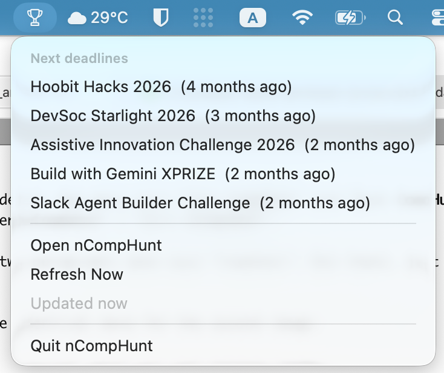

# nCompHunt

Native macOS app that finds and indexes competitions - competitive programming,
AI challenges, CTFs, hackathons, and design contests - in Vietnam and globally,
and lists them with sort and group controls, category and region filters, a menu
bar extra, and native notifications for new finds.



Built in Swift 6 / SwiftUI with SwiftData persistence. No account, no telemetry,
no server: the app talks directly to the public sources below and everything
stays on your Mac.


## Install

- **Homebrew** (recommended): `brew install --cask nhannht/tap/ncomphunt`
- **Direct download**: grab the latest notarized `.dmg` from
  [Releases](https://github.com/nhannht/ncomphunt/releases)
- **Build from source**: see [Build](#build) below

On first launch, macOS asks you to confirm opening an app downloaded from the
internet - click **Open**. nCompHunt is signed with an Apple Developer ID and
notarized by Apple, so you will not see an "unidentified developer" warning.

## Sources

Every source has an enable checkbox in Settings; a failing or unconfigured
source is skipped, never kills a refresh. The keyless sources below need zero
configuration and fill every category out of the box.

- CTFtime API v1 - the canonical worldwide CTF calendar
- Devpost - global hackathons with prizes, themes, and deadlines
- Codeforces API - upcoming competitive-programming rounds (keyless)
- MLContests - open AI/ML competitions across Kaggle, Zindi, Codabench, Hugging
  Face, DrivenData, and AIcrowd (keyless)
- ybox.vn - Vietnamese student and professional competitions
- Contest Watchers - creative and design competition directory (RSS)
- clist.by API v4 - aggregator broadening competitive programming with AtCoder,
  LeetCode, CodeChef, HackerRank and hundreds more (requires a free API key)
- Brave Search + Google Programmable Search - lead discovery over a fixed
  bilingual query catalog, at most once per day to stay inside free API quotas
  (both need free keys; leads with no dates age out after 14 days unseen)

## Configuration (optional API keys)

Keyed sources read credentials from `~/.claude/secrets.yml`, a flat YAML file
of UPPER_SNAKE_CASE keys:

```yaml
CLIST_USERNAME: your-clist-username
CLIST_API_KEY: your-clist-api-key
BRAVE_API_KEY: your-brave-search-api-key
GOOGLE_CSE_KEY: your-google-api-key
GOOGLE_CSE_CX: your-programmable-search-engine-id
```

Missing or placeholder values simply disable that source. In-app key management
(Keychain-backed Settings, no YAML file) is the next milestone on the roadmap.

The optional YouTrack action reads its base URL and bearer token from
`~/.claude.json` under `mcpServers.youtrack` and files one Task issue per
competition into a `COMP` project.

## Actions


Right-click any row (or use the detail header menu): open page, share via the
system sheet (Notes, Messages, Mail, AirDrop), copy link, add to Calendar as an
.ics import, and file into YouTrack (if configured).

## Layout

- `Sources/CompHuntKit/` - core library: models, source plugins, refresh engine,
  YouTrack sink (SwiftPM)
- `Tests/CompHuntKitTests/` - fixture-based parser, classifier, and dedupe tests
- `App/` - SwiftUI app (main window + menu bar extra), project generated with
  XcodeGen from `App/project.yml`

## Build

- Tests: `swift test`
- App: `cd App && xcodegen generate && xcodebuild -project CompHunt.xcodeproj -scheme CompHunt build`

## Requirements

- macOS 15+; building from source needs Xcode 26+ and XcodeGen

## License

MIT - see [LICENSE](LICENSE).
