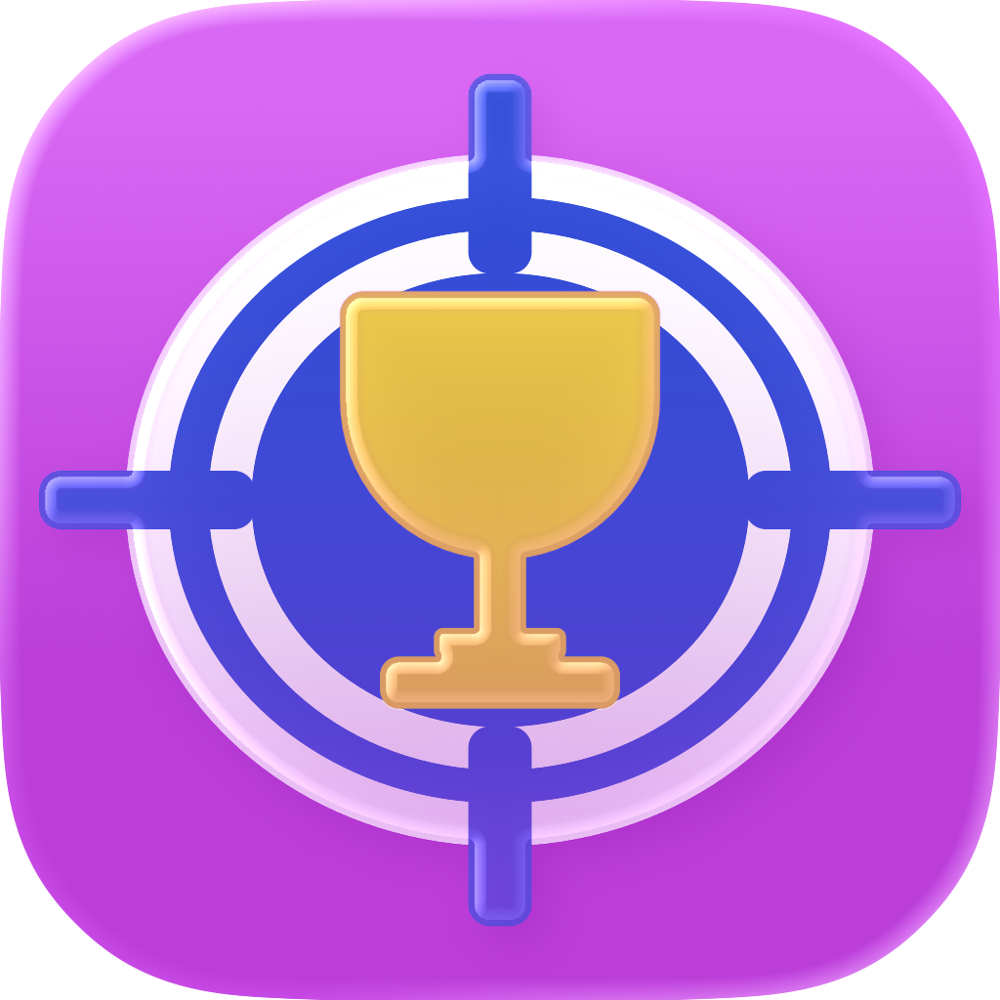
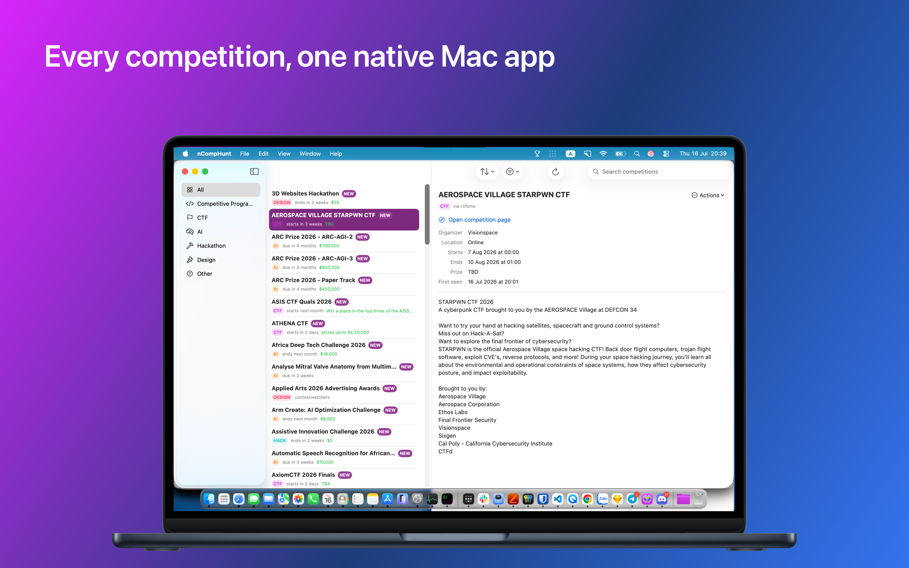
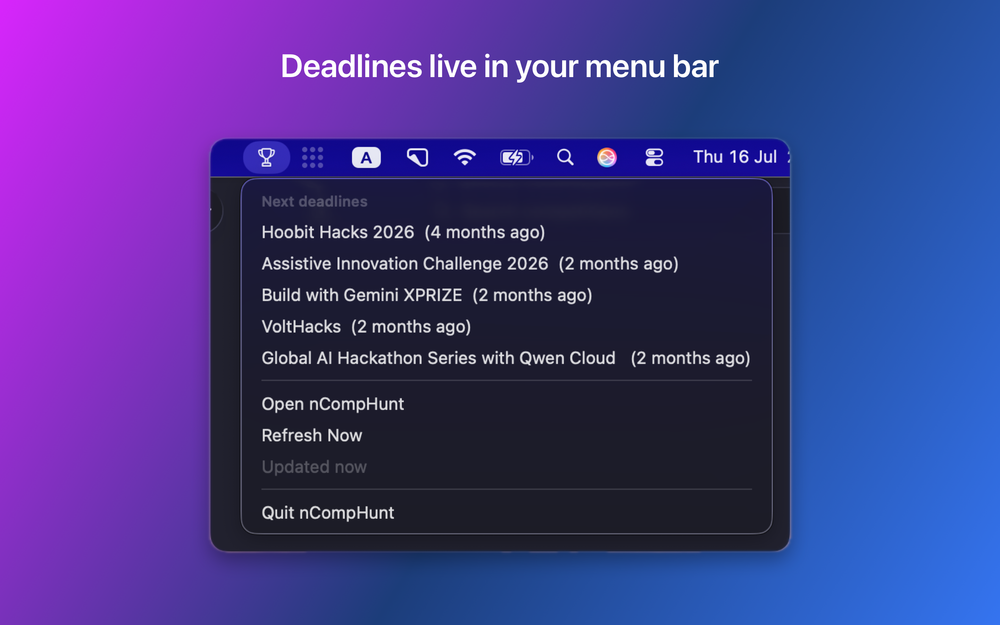
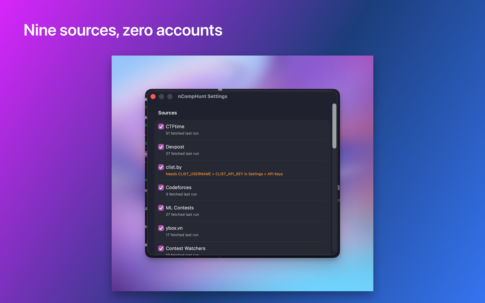
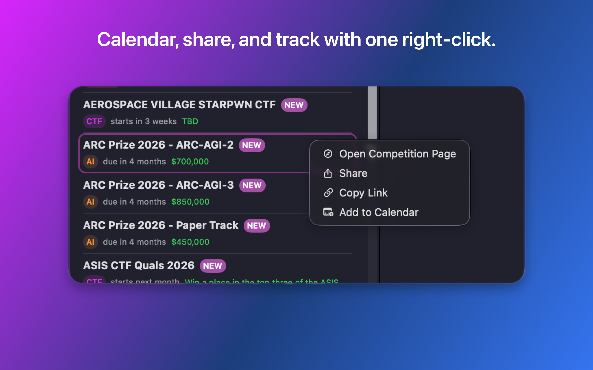
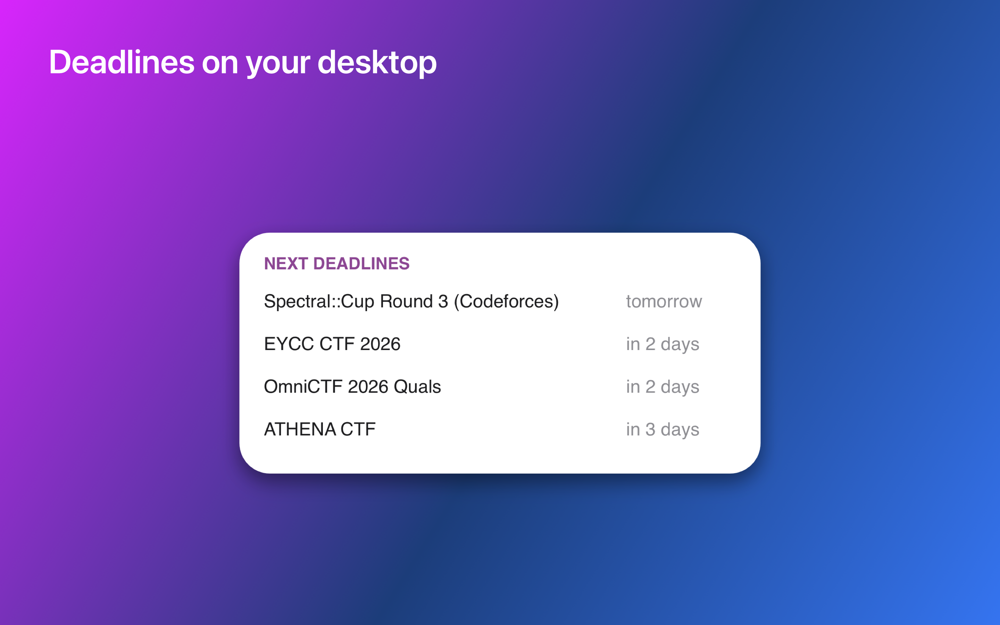

  

<h1 align="center">nCompHunt</h1>

  

  
  
  
  
  

Native macOS app that finds and indexes competitions - competitive programming,
AI challenges, CTFs, hackathons, and design contests - in Vietnam and globally,
and lists them with sort and group controls, category and region filters, a menu
bar extra, native notifications for new finds, and an optional sync into a
dedicated Apple Calendar that keeps every deadline up to date.

Built in Swift 6 / SwiftUI with SwiftData persistence. There is no account to
create and no setup: the app talks directly to the public sources below and
keeps its index in local storage on your Mac.

## Install

- **Mac App Store** (recommended):
  [nCompHunt on the Mac App Store](https://apps.apple.com/app/id6791654003) -
  free, and updates arrive automatically
- **Homebrew**: `brew install --cask nhannht/tap/ncomphunt`
- **Direct download**: grab the latest notarized `.dmg` from
  [Releases](https://github.com/nhannht/ncomphunt/releases)
- **Build from source**: see [Build](#build) below

Every build is sandboxed and behaves identically. The only difference is first
launch: the Homebrew and direct-download builds are signed with an Apple
Developer ID and notarized by Apple, so macOS asks you once to confirm opening
an app downloaded from the internet - click **Open**. You will not see an
"unidentified developer" warning. The Mac App Store build skips that prompt.

## Sources

Every source has an enable checkbox in Settings; a failing or unconfigured
source is skipped, never kills a refresh. The keyless sources below need zero
configuration and fill every category out of the box.

- CTFtime API v1 - the canonical worldwide CTF calendar
- Devpost - global hackathons with prizes, themes, and deadlines
- Codeforces API - upcoming competitive-programming rounds (keyless)
- MLContests - open AI/ML competitions across Kaggle, Zindi, Codabench, Hugging
  Face, DrivenData, and AIcrowd (keyless)
- ybox.vn - Vietnamese design, scholarship, and general-interest competitions
  (Vietnam's CP/CTF/AI contests arrive through the aggregators above, tagged by
  region detection)
- Contest Watchers - creative and design competition directory (RSS)
- clist.by API v4 - aggregator broadening competitive programming with AtCoder,
  LeetCode, CodeChef, HackerRank and hundreds more (requires a free API key)
- Brave Search + Google Programmable Search - lead discovery over a fixed
  bilingual query catalog, at most once per day to stay inside free API quotas
  (both need free keys; leads with no dates age out after 14 days unseen)

## Configuration (optional API keys)

Enter optional API keys under **Settings > API Keys**. Keys are stored securely
in the macOS Keychain, and each keyed source turns on as soon as its key is
present. Missing keys simply disable that source.

The keys are:

- `CLIST_USERNAME` + `CLIST_API_KEY` - clist.by
- `BRAVE_API_KEY` - Brave Search
- `GOOGLE_CSE_KEY` + `GOOGLE_CSE_CX` - Google Programmable Search

If you used an older build backed by a `~/.claude/secrets.yml` file, the
**Import from secrets.yml** button migrates those keys into the Keychain. It
opens a file picker, which is what grants the sandboxed app access to that file,
so the migration works in every build.

The optional YouTrack action files one Task issue per competition into a `COMP`
project. Enter the instance base URL and a bearer token under
**Settings > YouTrack**; both are stored in the Keychain alongside the API keys.
The `~/.claude.json` discovery under `mcpServers.youtrack` is a fallback for the
`CompHuntKit` library outside the app (tests and CLI use) - the shipped app is
sandboxed and cannot reach that file.

## Actions

Right-click any row (or use the detail header menu): open page, share via the
system sheet (Notes, Messages, Mail, AirDrop), copy link, add to Calendar as an
.ics import, and file into YouTrack (if configured).

## Widget

An **Upcoming Contests** widget for the desktop and Notification Centre, in
small and medium sizes, showing the next competitions with a live countdown. It
reads a snapshot the app writes into a shared App Group container.

## Layout

- `Sources/CompHuntKit/` - core library: models, source plugins, refresh engine,
  YouTrack sink (SwiftPM)
- `Tests/CompHuntKitTests/` - fixture-based parser, classifier, and dedupe tests
- `App/` - SwiftUI app (main window + menu bar extra + widget), project generated
  with XcodeGen from `App/project.yml`

## Build

- Tests: `swift test`
- App: `cd App && xcodegen generate && xcodebuild -project CompHunt.xcodeproj -scheme CompHunt build`

## Requirements

- macOS 26+; building from source needs Xcode 26+ and XcodeGen

## License

MIT - see [LICENSE](LICENSE).
